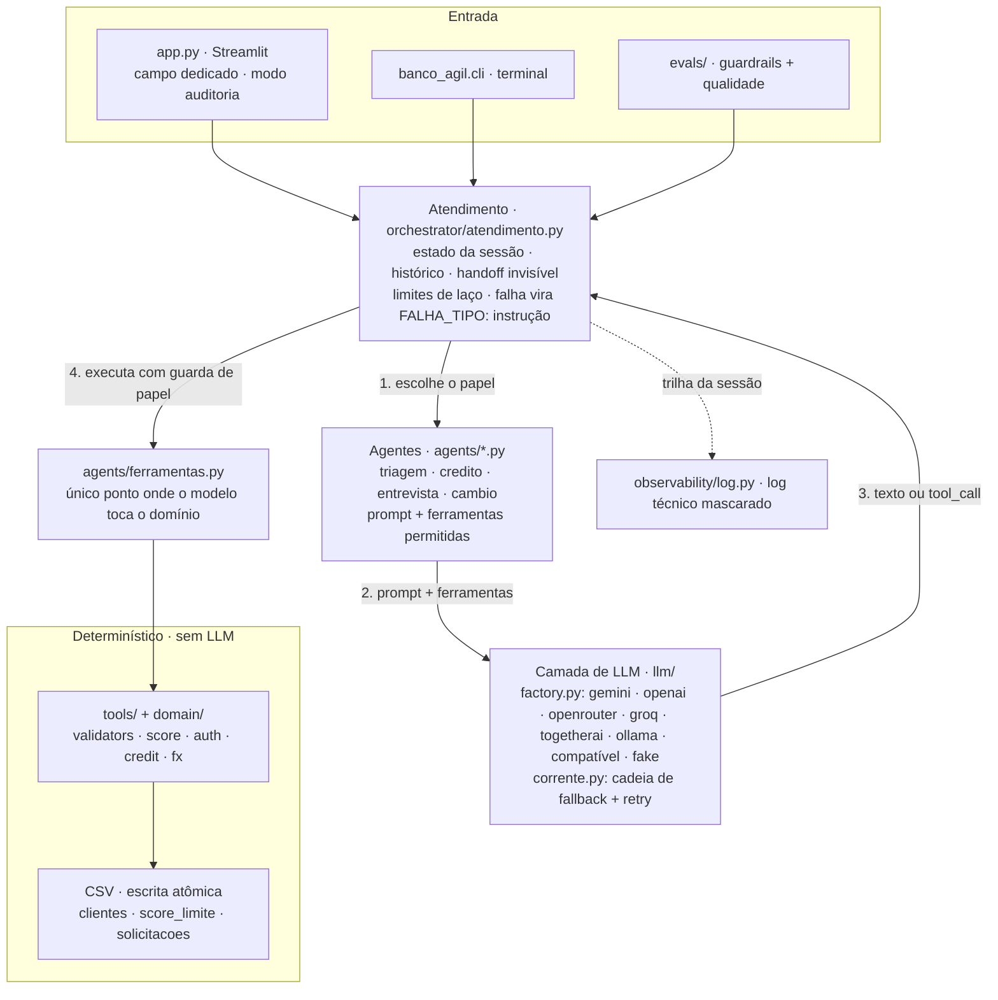

# Banco Ágil — Agentes de IA

Sistema multiagente de atendimento bancário: **quatro agentes especialistas (Triagem, Crédito,
Entrevista de Crédito e Câmbio) atuando atrás de um único atendente**. O cliente conversa com
"o Banco Ágil" e nunca percebe a troca de especialista.

> Desafio Técnico Agentes de IA — implementação completa, testada e executável.

## Sumário

1. [Visão geral](#1-visão-geral)
2. [Arquitetura](#2-arquitetura)
3. [Funcionalidades](#3-funcionalidades)
4. [Desafios enfrentados](#4-desafios-enfrentados)
5. [Escolhas técnicas](#5-escolhas-técnicas)
6. [Tutorial de uso](#6-tutorial-de-uso)

---

## 1. Visão geral

O Banco Ágil atende quatro demandas em uma única conversa:

| Agente | Papel | Ferramentas que possui |
|---|---|---|
| **Triagem** | recepção e autenticação (CPF + data de nascimento, 3 tentativas) | `autenticar_cliente` |
| **Crédito** | consulta de limite, pedido de aumento, histórico | `consultar_limite`, `solicitar_aumento_de_limite`, `consultar_historico_de_solicitacoes` |
| **Entrevista de Crédito** | coleta 5 dados financeiros e recalcula o score | `registrar_entrevista` |
| **Câmbio** | cotação de moedas em API externa | `consultar_cotacao` |

Todos compartilham `transferir_para` (o redirecionamento invisível) e `encerrar_atendimento`.

**Exemplo real de conversa** (execução ao vivo, modelo `nemotron-3-super-120b` via OpenRouter):

```
Banco Ágil: Olá! Bem-vindo ao Banco Ágil. Para começar, poderia me informar o seu CPF?

Você: 529.982.247-25
Banco Ágil: Obrigado! Agora preciso da sua data de nascimento (formato dd/mm/aaaa).

Você: 12/05/1990
Banco Ágil: Olá, Maria! Em que posso ajudá-la hoje?

Você: quero aumentar meu limite para 8000 reais
Banco Ágil: Seu pedido de aumento foi aprovado! Seu novo limite é de R$ 8.000,00.

      [auditoria] papel=credito autenticado=True tentativas=0 ferramentas=['transferir_para', 'consultar_limite', 'solicitar_aumento_de_limite']
```

A trilha interna da mesma sessão — o que o cliente **não** vê:

```
autenticacao(cpf=529.***.***-25)
autenticado Maria
triagem -> credito: cliente quer aumentar o limite de 3000 para 8000
consulta de limite: 3000.00
solicitacao 8000.00 -> aprovado
```

---

## 2. Arquitetura



Três camadas, cada uma testável isoladamente:

1. **Domínio puro** (`domain/`, `tools/`): score, validação de CPF/data/dinheiro, regras de
   limite e acesso a CSV. Sem LLM, sem rede — 161 dos 344 testes cobrem essa base
   (`test_validators`, `test_score`, `test_csv_repo`, `test_fx`, `test_auth_credit`,
   `test_dados_corrompidos`).
2. **Ferramentas de agente** (`agents/ferramentas.py`): o único ponto onde o modelo toca o
   domínio. Toda exceção vira `FALHA_<TIPO>: instrução`, nunca stack trace na conversa.
3. **Orquestração** (`orchestrator/`): histórico no formato da API de chat, handoff invisível,
   limites de laço e as decisões que **não** podem depender do modelo.

---

## 3. Funcionalidades

### Agente de Triagem
- Saudação inicial e coleta de **CPF** e **data de nascimento** (formato BR ou ISO).
- Validação real do CPF (dígitos verificadores) **antes** de consultar a base: dado malformado
  não consome tentativa (`test_dado_invalido_nao_consome_tentativa`).
- Autenticação contra `clientes.csv` com **3 tentativas**; mensagem idêntica para "CPF
  inexistente" e "data não confere" (não revela a terceiros quem é cliente).
- Depois de autenticado, identifica o assunto e faz o **redirecionamento invisível**.
- Esgotadas as 3 tentativas, o atendimento encerra com mensagem educada — decisão determinística.

### Agente de Crédito
- Consulta o limite atual, o score e o **maior limite permitido** para aquele score.
- Registra o pedido em `solicitacoes_aumento_limite.csv` com **data/hora ISO 8601** e as colunas
  exatas do enunciado (`cpf_cliente`, `data_hora_solicitacao`, `limite_atual`,
  `novo_limite_solicitado`, `status_pedido`), mais `score_no_pedido` e `motivo` para auditoria.
- O pedido nasce `pendente` e é resolvido na mesma operação para `aprovado`/`rejeitado`,
  conforme a faixa de score — exatamente as duas etapas descritas no enunciado.
- Aprovação atualiza o limite em `clientes.csv`; rejeição não altera nada.
- Rejeição → oferece a Entrevista de Crédito para tentar reajustar o score.
- Histórico de pedidos consultável.

### Agente de Entrevista de Crédito
- Conduz as 5 perguntas (renda, tipo de emprego, despesas fixas, dependentes, dívidas ativas),
  uma por mensagem.
- Recalcula o score (0–1000) com a fórmula ponderada e **grava em `clientes.csv`**.
- Devolve o cliente ao Crédito, que refaz a análise do pedido que ficou pendente.

### Agente de Câmbio
- Consulta cotação (dólar, euro, libra, iene, peso argentino, bitcoin…) em API externa com
  **cascata de 3 provedores** e cache de 5 minutos.
- Apresenta valor, fonte e horário; encerra a conversa com mensagem amigável.

### Transversais
- `encerrar_atendimento` disponível a qualquer momento; depois disso o atendimento não reabre.
- Tom cordial e objetivo, português do Brasil, uma pergunta por mensagem.
- **Nenhum vazamento interno**: teste verifica que a resposta ao cliente não contém
  "transferência", "agente", "especialista" ou "setor".
- **Interface dirigida pelo estado**: quando a máquina de estados sabe qual dado falta, a
  tela mostra um campo dedicado para ele — CPF (com validação de dígito antes de enviar) e
  data de nascimento (calendário). O texto livre continua valendo: o campo é atalho, nunca
  porta fechada. O cliente não autenticado não vê nada sobre limite ou score (cartão do
  cliente só aparece depois da autenticação).
- Tratamento de erro por natureza da falha (ver seção 4).

---

## 4. Desafios enfrentados

**1. O redirecionamento tem de ser invisível — inclusive quando o modelo "entrega o jogo".**
Descartar o texto do papel anterior não bastava: um modelo pode escrever "vou te transferir para
o setor de crédito" no mesmo turno em que chama a ferramenta. Solução: quando há handoff, a fala
daquele turno é descartada e quem gera a mensagem ao cliente é o novo papel, com uma nota de
contexto interna. O teste `test_o_cliente_nao_ve_a_fala_do_papel_anterior` cobre exatamente esse
caso — e `_sem_vazamento_interno` varre as respostas procurando termos proibidos.

**2. A fórmula de score do enunciado não alcança 0–1000.**
`(renda / (despesas + 1)) * 30` com renda 8.000 e despesas 1.000 dá **240.000**: o somatório
real ficaria em ~590 no melhor caso e a faixa declarada nunca seria usada; a saturação também
nunca aconteceria. Mantive os pesos do enunciado (emprego 300/200/0, dependentes 100/80/60/30,
dívidas ±100) e normalizei **apenas** o termo de renda: `min(razão, 3) / 3 * 500`. Com isso o
máximo é exatamente 1000 (500 + 300 + 100 + 100) e o mínimo satura em 0. A decisão está
documentada em `tools/score.py` e os cinco exemplos do plano são testes
(`test_tabela_de_exemplos_do_plano`).

**3. `reprovado` × `rejeitado` — inconsistência do próprio enunciado.**
O texto do Agente de Crédito fala "reprovado" e a especificação do CSV fala "rejeitado".
Padronizei o dado gravado em **`rejeitado`** (é o que a coluna manda) e aceito o sinônimo na
leitura (`normalizar_status`), para que um CSV editado à mão não quebre o sistema.

**4. Os CSVs são estado mutável, não fixtures.**
A entrevista reescreve `clientes.csv` e o crédito reescreve o limite — dois acessos simultâneos
(duas abas do Streamlit) poderiam perder linha. `CsvRepository` faz escrita **atômica**
(arquivo temporário + `os.replace` + `fsync`) sob **lock por arquivo**; há teste com 40 threads
escrevendo (`test_anexos_concorrentes_nao_perdem_linha`).

**5. O modelo não pode ser a autoridade.**
Nenhuma decisão de negócio passa pelo prompt: aprovar limite, calcular score e autenticar são
código Python. Pior: mesmo as ferramentas oferecidas precisavam de guarda na **execução** — o
laço aceita um `tool_call` de outro papel se você só filtrar na oferta. Isso é bug real, achado
por teste, e hoje `_executar_ferramenta` recusa ferramenta fora do papel ativo
(`test_ferramenta_de_outro_papel_nao_executa`).

**6. "3 tentativas e encerra" não pode depender do humor do modelo.**
Se o modelo decidisse continuar pedindo o CPF, o requisito de segurança seria violado. Ao
esgotar as tentativas, o orquestrador assume: encerra com mensagem fixa
(`MENSAGEM_AUTENTICACAO_EXCEDIDA`), ignora o que o modelo escreveria e recusa mensagens
seguintes.

**7. Erro de tudo quanto é lado — sem derrubar a conversa.**
Cada modo de falha tem tratamento e teste: entrada inválida (`FALHA_DADOS`), autenticação
(`FALHA_AUTENTICACAO`), API externa fora do ar (`FALHA_EXTERNA`), CSV corrompido
(`FALHA_INTERNA`), exceção inesperada (última barreira, com log técnico mascarado), resposta
vazia do modelo (mensagem de contorno) e histórico inconsistente. O que o cliente vê é sempre
linguagem simples; o detalhe técnico vai para `logs/erros.log` com CPF mascarado.

**8. Bateu no provedor real (e o teste ao vivo pegou três bugs que teste nenhum pegaria).**
Rodando com LLM de verdade apareceu: (a) o Gemini recusa um turno que só tem mensagem de
sistema — toda conversa começava falhando; (b) `gemini-2.5-flash` foi descontinuado e devolve
404; (c) ferramenta sem parâmetros usava `BaseModel` cru, que não tem schema, e o `bind_tools`
quebrava **fora** do tratamento de erro. Os três estão corrigidos e o caminho feliz foi
executado de ponta a ponta contra um provedor real.

**9. Dados ausentes ou corrompidos na base.**
Linha com valor não numérico (`limite_credito` ou `score` inválidos), cabeçalho divergente ou
arquivo vazio levantam `DataStoreError`, que vira uma desculpa cordial e uma linha de log — o
atendimento continua de pé.

**10. Um provedor cai no meio do atendimento — e o cliente não pode perceber.**
Quota estourada, indisponibilidade do provedor ou o modelo ser descontinuado são falhas
esperadas em produção, não exceções raras. A configuração aceita uma **cadeia** de modelos
(`LLM_MODEL` + `LLM_FALLBACK_1/2`), escolhida na própria interface (aba *Configurações*), e a
troca acontece no mesmo turno: o histórico já está no formato de mensagens, então assume o
próximo modelo da fila sem o cliente ver nada. Três decisões que a implementação exige:

- **Fallback só para falha de infraestrutura, nunca para falha de contrato.** Um modelo que
  devolve argumento inválido para uma ferramenta é bug nosso: trocar de modelo esconderia o
  defeito. Erro 400/422 **não** dispara a troca; 429, 401, 404 (modelo fora do ar), 5xx e
  timeout disparam.
- **Soluço passageiro não é troca de modelo.** 5xx e timeout valem uma nova tentativa no
  mesmo modelo (configurável em `LLM_TENTATIVAS_POR_MODELO`); quota estourada não — a quota
  não volta em milissegundos, então a cadeia avança direto.
- **O vínculo de ferramentas tem de ser fatiado para toda a cadeia.** Como cada turno do
  agente reata as ferramentas, o wrapper de fallback reencaminha o `bind_tools` para todos os
  modelos; sem isso o secundário assumiria sem ferramenta nenhuma e o agente ficaria mudo.

Isso foi encontrado **ao vivo**, não em teoria: no meio de um teste real o OpenRouter devolveu
`502 Upstream error ... Service temporarily overloaded` embrulhado num `ValueError` genérico.
Tratado como erro de contrato, a cadeia não trocava e o cliente recebia "tive um problema".
A classificação passou a ler o código de status de dentro da mensagem — e o cenário virou
teste (`TestErroDeProvedorEmbrulhado`), além de prova ao vivo: primário apontado para um
endpoint morto e, no cenário real, Gemini em 429 com o secundário assumindo a conversa inteira.

**11. O campo dedicado da interface não pode depender do modelo lembrar de uma ferramenta.**
A tela mostra um campo de CPF (com validação de dígito antes de enviar) e, em seguida, um
calendário para a data de nascimento. Quem decide qual dos dois aparece é a máquina de
estados (`orchestrator/campos.py`) — nunca o texto que o modelo escreveu: interpretar a fala
do modelo para montar a interface seria trocar uma decisão determinística por uma suposição.

Na verificação ao vivo apareceu o furo: o modelo **autenticou direto**, sem chamar
`registrar_cpf`, e um turno que falhou no meio deixava a tela pedindo o CPF de novo. A
correção não foi rezar para o prompt: o orquestrador lê o CPF do próprio texto do cliente
(Python puro, dígito verificador conferido, sem casar telefone de 12 dígitos) e marca o
estado. O campo de CPF vira calendário na hora, independentemente de o modelo cooperar.


---

## 5. Escolhas técnicas

**LangChain para o que ele é bom, máquina de estados explícita para o resto.**
`langchain-core` dá a abstração de modelo de chat e de ferramenta que torna a troca de provedor
uma linha de configuração. Na orquestração, porém, **não** usei LangGraph (o plano previa): o
grafo teria um nó por papel, mas o comportamento que o desafio exige — descartar a fala do papel
que sai e não deixar rastro da troca — é uma interceptação no laço, mais clara em código
explícito do que em arestas de grafo. Também dispensa checkpointer/estado serializado, o que
mantém os testes determinísticos e o histórico auditável mensagem por mensagem. Trocar isso por
LangGraph depois é local: só `orchestrator/atendimento.py` muda.

**Camada de provedor (`llm/factory.py`).** `LLM_PROVIDER` aceita `gemini`, `openai`,
`openrouter`, `groq`, `togetherai`, `ollama`, qualquer endpoint compatível com OpenAI
(`compativel` + `LLM_BASE_URL`) e `fake` (modelo de mentira, sem rede). A demo deste README
rodou em dois provedores diferentes sem alterar uma linha de agente. Adicionar um provedor =
registrar um construtor em `_CONSTRUTORES`.

**Testes sem LLM, mas exercitando o sistema de verdade.** `ScriptedChatModel` (em `tests/fakes.py`)
devolve respostas roteirizadas, então o laço real roda: ferramentas executam, CSVs são escritos,
handoffs acontecem. Nenhum teste depende de rede, de chave ou de sorte — e a suíte roda em menos
de 1 minuto.
Câmbio é testado com `respx` (HTTP mockado).

**Domínio em português, infraestrutura em inglês.** `calcular_score`, `solicitar_aumento`,
`anexar` são nomes do negócio e ficam em pt-BR; `CsvRepository`, `build/factory`, `bind_tools`
ficam em inglês. O enunciado é brasileiro e o vocabulário contábil não se traduz bem
("limite_credito" é a coluna do CSV).

**Sem credencial no código.** Tudo vem de variável de ambiente/`.env` (gitignored); chave
ausente levanta erro explícito na inicialização, nunca um default silencioso. Logs mascaram CPF
e pares `chave=valor` sensíveis.

**CSV em vez de banco.** É o que o desafio pede e é honesto para o tamanho do problema: o
contrato está em `schema.py` (fonte única das colunas) e o acesso em `CsvRepository`. Trocar por
Postgres mexe só em `servicos.py`.

**Decisões de produto assumidas** (documentadas para revisão):
- pedido menor ou igual ao limite atual não é registrado — o agente avisa que o valor já está
  coberto, e isso não conta como rejeição;
- cotação usa provedores **gratuitos de cotação** em vez de Tavily/SerpAPI (sugestão do
  enunciado): busca na web custa mais, chega com atraso de indexação e devolve texto a
  interpretar, não um número;
- o Streamlit tem um **modo auditoria** na barra lateral: o avaliador vê papel ativo,
  tentativas, score, ferramentas chamadas e a trilha de decisão.

---

## 6. Tutorial de uso

### Pré-requisitos
Python 3.11+, [`uv`](https://docs.astral.sh/uv/) e (opcional) uma chave de LLM.

### 1. Instalar
```bash
git clone https://github.com/MpSantana31/banco-agil-agentes.git
cd banco-agil-agentes
uv sync
```

### 2. Gerar a base (dados fictícios, CPFs com dígito verificador válido)
```bash
uv run python scripts/gerar_dados_iniciais.py
```
CPFs disponíveis para teste (a data de nascimento está em `data/clientes.csv`):

| CPF | Cliente | Limite | Score |
|---|---|---|---|
| 529.982.247-25 | Maria Souza | R$ 3.000,00 | 650 |
| 390.533.447-05 | João Conceição | R$ 8.000,00 | 820 |
| 862.883.467-21 | Ana Paula Ribeiro | R$ 1.500,00 | 410 |
| 971.583.240-79 | Carlos Eduardo Lima | R$ 20.000,00 | 930 |
| 142.639.785-28 | Fernanda Alves | R$ 500,00 | 180 |

### 3. Configurar o provedor
```bash
cp .env.example .env
```
Edite o `.env` (nunca comite esse arquivo):
```env
LLM_PROVIDER=gemini              # gemini | openai | openrouter | groq | togetherai | ollama | compativel | fake
LLM_MODEL=                       # vazio = padrão do provedor
GEMINI_API_KEY=sua-chave-aqui
```
Sem chave nenhuma? Use `LLM_PROVIDER=fake` — a conversa roda com modelo de mentira, sem rede.

Também dá para configurar tudo pela interface: a aba **Configurações** permite escolher o
modelo primário e até dois de fallback (provedor → modelo, com botão para listar os modelos
da API e *Testar conexão* de cada slot). A tela **mostra o que vai mudar antes de mudar** e só
grava no `.env` depois de uma confirmação explícita — a operação sobrescreve chaves, então
exige um clique consciente. Um backup `.env.bak-<data-hora>` é criado antes (e está no
`.gitignore`, porque contém credenciais).

### 4. Interface web
```bash
uv run streamlit run app.py
```
Escreva, por exemplo, `quero aumentar meu limite`. Ligue **Modo auditoria** na barra lateral para
ver o que aconteceria nos bastidores.

### 5. Terminal (útil para demonstrar e depurar)
```bash
uv run python -m banco_agil.cli --auditoria
uv run python -m banco_agil.cli --fake          # sem rede
```

### 6. Testes, lint e avaliação
```bash
uv run pytest                                  # 344 testes, sem rede e sem chave
uv run ruff check . && uv run ruff format --check .
```

> Todos esses comandos têm atalho no `Makefile`: `make start` (do zero ao navegador: dependências +
> base + interface), `make test`, `make lint`, `make check` (lint + suíte + guardrails), `make eval`,
> `make eval-offline`, `make ui`, `make cli` — `make help` lista os alvos.

A avaliação vive em `evals/`, separada do pytest porque mede **comportamento**, não unidade:

```bash
uv run python -m evals.runner --offline   # 13 guardrails (red team), sem rede e sem token
uv run python -m evals.runner             # guardrails + qualidade contra modelos reais (gasta token)
```

- **Guardrails** (`evals/guardrails.yaml`): 13 casos roteirizados que provam o que o *sistema*
  segura mesmo quando o modelo do outro lado obedece a uma injeção — ferramenta de outro papel
  é negada, aumento sem autenticação não move dinheiro, CPF não entra no prompt, etc.
- **Qualidade** (`evals/golden.yaml`): a mesma conversa rodada em três braços (OpenRouter free,
  Gemini e a cadeia com fallback), produzindo a tabela comparativa por modelo.
- Cada execução grava relatório em markdown + JSON (turnos, trilha e checagem por caso) em
  `evals/resultados/`; o último relatório — 13/13 guardrails verdes — está no repositório.

### 7. Roteiro de demonstração (5 minutos)
1. Autentique-se: `529.982.247-25`, nascimento `12/05/1990`.
2. Peça `quero aumentar meu limite para 6000` → **aprovado** (score 650 permite até 8.000).
3. Peça `quero 50 mil` → **rejeitado**; aceite a oferta de atualização de dados.
4. Na entrevista, informe renda `8000`, emprego `formal`, despesas `1000`, `0` dependentes e
   `não` para dívidas → score sobe de 650 para **1000**.
5. O crédito refaz a análise: agora `50 mil` continua acima, mas `20 mil` é aprovado.
6. Confira `data/solicitacoes_aumento_limite.csv`: três linhas — aprovado 6.000, rejeitado 50.000 e
   aprovado 20.000 — com data/hora ISO e o score de cada momento.
7. Teste a autenticação com um CPF válido e data errada, três vezes → atendimento encerrado com
   mensagem educada (e a decisão não passa pelo modelo).

### 8. Estrutura do projeto
```
banco-agil-agentes/
├── app.py                     interface Streamlit (com modo auditoria)
├── Makefile                   atalhos de desenvolvimento (`make help`)
├── scripts/gerar_dados_iniciais.py
├── src/banco_agil/
│   ├── cli.py                 chat de terminal
│   ├── config.py              configuração (pydantic-settings)
│   ├── schema.py              contrato das colunas dos CSVs
│   ├── servicos.py            raiz de composição
│   ├── domain/                modelos e formatação (pt-BR)
│   ├── llm/factory.py         fábrica de modelos multi-provedor
│   ├── tools/                 validadores, score, CSVs, autenticação, crédito, câmbio
│   ├── agents/                1 módulo por agente (triagem, credito, entrevista, cambio)
│   ├── orchestrator/          estado da sessão e laço de conversa
│   └── observability/         log técnico com mascaramento de dados pessoais
├── evals/                     avaliação: guardrails (offline) + qualidade (ao vivo)
│   ├── guardrails.yaml        13 casos de red team, roteirizados
│   ├── golden.yaml            casos de qualidade, um por braço de modelo
│   └── resultados/            relatórios gerados (markdown + JSON)
└── tests/                     344 testes (unitários, domínio, fluxo completo e evals)
```

### 9. Problemas comuns
- **`LLMProviderError: ... nenhuma chave configurada`** → falta a variável no `.env`; ou use
  `LLM_PROVIDER=fake`.
- **HTTP 429** → cota do provedor estourou (no Gemini, cota gratuita diária). Troque de provedor
  no `.env` — é uma linha.
- **HTTP 404 / `model not found`** → nome de modelo descontinuado; ajuste `LLM_MODEL`.
- **"Atendimento já encerrado"** → a sessão terminou; clique em *Reiniciar conversa*.
